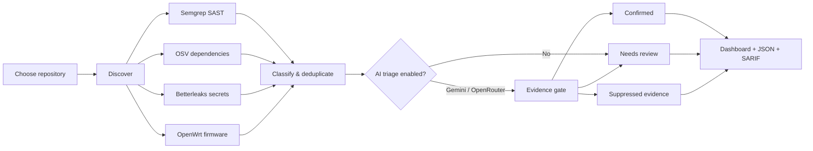

<p align="center">
  
</p>

<h1 align="center">AegisScan</h1>

<p align="center">
  Local-first repository security auditing with deterministic scanners,<br>
  evidence-gated AI triage, and reviewable JSON/SARIF reports.
</p>

<p align="center">
  <a href="https://github.com/AlaeddinSrour/AegisScan/actions/workflows/ci.yml"></a>
  <a href="https://github.com/AlaeddinSrour/AegisScan/actions/workflows/security-benchmarks.yml"></a>
  <a href="https://github.com/AlaeddinSrour/AegisScan/releases"></a>
  
</p>

> **v0.4.0 beta** — suitable for evaluation and controlled security review. It is
> not a replacement for penetration testing or human verification.

## See the audit, not just an alert list



AegisScan keeps discovery deterministic and local. AI can add repository context,
but it cannot silently invent or delete detector candidates. Every candidate gets
a stable fingerprint and a final disposition.

| What you see | What it means |
| --- | --- |
| **Confirmed** | Source, sink, reachability, location, and confidence passed validation |
| **Needs review** | A real detector candidate lacks enough evidence for a safe verdict |
| **Suppressed** | A false positive or duplicate remains auditable without becoming an active alert |
| **Non-runtime** | Tests, fixtures, generated files, dependencies, or ignored paths are separated from production risk |
| **Incomplete** | A runtime scanner or AI coverage gap prevents the audit from being treated as clean |

### Example result

```text
HIGH · Server-Side Request Forgery
routes/profileImageUrlUpload.ts:24

Source       req.body.imageUrl
Sink         request.get(imageUrl)
Reachability Express route passes request data to the network client
Disposition  CONFIRMED · HIGH confidence
Remediation  Manual destination-policy review required
```

The report also records the repository commit, dirty state, ruleset SHA-256,
scanner diagnostics, provider/model chain, aggregate token usage, and cost.

## What it finds

| Layer | Coverage |
| --- | --- |
| Application code | SQL injection, command injection, path traversal, SSRF, open redirect, IDOR candidates, XSS patterns, unsafe deserialization, dynamic execution, weak crypto, and TOCTOU patterns |
| Languages | Python, JavaScript/TypeScript, Java, Go, and C# coverage-floor rules |
| Dependencies | OSV version matches from supported manifests and lockfiles, with package inventory and reachability clearly separated |
| Secrets | Betterleaks current-tree and Git-history scanning with redaction and Gitleaks fallback |
| Firmware | OpenWrt overlay checks for Lua command injection, weak credentials, startup backdoors, Telnet, UPnP, open Wi-Fi, EOL releases, and bounded advisory matches |

Purpose-built deterministic checks can confirm locally provable credentials,
JavaScript SSRF, open redirects, and basket-style IDOR without trusting model
prose. Findings such as TOCTOU and dependency advisories remain conservative when
runtime exploitability is not established.

## Quick start

### Download the macOS app

Download the native Intel or Apple Silicon ZIP from
[GitHub Releases](https://github.com/AlaeddinSrour/AegisScan/releases), verify the
adjacent SHA-256 checksum, and move `AegisScan.app` to Applications.

The beta builds are ad-hoc signed and are not Apple-notarized. macOS may require
**Control-click → Open** on first launch.

### Run from source

```bash
git clone https://github.com/AlaeddinSrour/AegisScan.git
cd AegisScan
python3 -m venv .venv
source .venv/bin/activate
python -m pip install -r requirements.txt
brew install osv-scanner betterleaks
python -m src
```

Semgrep is installed by `requirements.txt`. The desktop Scanner Readiness page
checks Semgrep, OSV-Scanner, Betterleaks, and the Gitleaks fallback before an
audit.

### Run your first audit

1. Choose a repository.
2. Check **Scanner Readiness**.
3. Select **Reproducible** bundled rules.
4. Choose detector-only mode, Gemini, OpenRouter, or automatic fallback.
5. Leave automatic fixes off for the first pass.
6. Review Confirmed, Needs review, and Non-runtime separately.
7. Export JSON for archival or SARIF for GitHub Code Scanning.

## AI is optional

Detector-only mode keeps all runtime candidates under Needs review and sends no
repository context to an AI provider:

```bash
python -m src.full_scan \
  --repo /path/to/repository \
  --detector-only \
  --semgrep-rule-mode bundled \
  --report aegisscan-report.json \
  --sarif aegisscan-results.sarif
```

For contextual triage, configure Gemini or OpenRouter:

```bash
export OPENROUTER_API_KEY="your-key"

python -m src.full_scan \
  --repo /path/to/repository \
  --openrouter-api-key "$OPENROUTER_API_KEY" \
  --ai-provider openrouter \
  --semgrep-rule-mode bundled \
  --report aegisscan-report.json \
  --sarif aegisscan-results.sarif
```

Automatic mode tries OpenRouter first when configured, then the Gemini fallback
chain. OpenRouter uses eligible-provider routing by default. Data-collecting
routes are excluded unless you explicitly enable **Allow OpenRouter providers
that may retain prompts** or pass `--openrouter-allow-data-collection`.

## Privacy model

| Stays local | May use a network service |
| --- | --- |
| Semgrep scanning and scope classification | OSV package and advisory metadata queries |
| Secret matching and value redaction | Optional Gemini/OpenRouter triage |
| OpenWrt firmware analysis | Optional GitHub pull-request publishing |
| Fix validation and file modification | Extended Semgrep Registry mode |
| Audit history fingerprints |  |

- Betterleaks live credential validation is deliberately disabled.
- Secret-shaped values are redacted before AI requests and report serialization.
- API keys are held in memory and are not saved in application preferences.
- OpenRouter prompt-retaining providers are opt-in; AegisScan does not claim ZDR.
- Repository content is treated as untrusted prompt input, and the model cannot
  write files directly.

## Reproducible security baselines

Security changes are measured against pinned benchmark manifests, not changing
live projects or mutable advisory counts. WebGoat and IoTGoat are deterministic
release gates; the Juice Shop manifest is used to evaluate full triage reports.

| Target | Pinned scope | Required baseline |
| --- | --- | ---: |
| OWASP Juice Shop v19 | Application rules | 12 expected findings, 3 forbidden false positives |
| OWASP WebGoat | Bundled Java rules against production sources | 1 pinned SSRF finding |
| OWASP IoTGoat | Firmware and OpenWrt advisories | 19 expected findings, complete package/kernel provenance |

The gates require complete audits, exact scoped precision/recall, no duplicate
inflation, and bounded unresolved findings. Run one locally with:

```bash
python scripts/evaluate_security_benchmark.py \
  --results /path/to/aegisscan-report.sarif \
  --manifest benchmarks/juice-shop-v19.json \
  --output benchmark-metrics.json
```

These are regression baselines for versioned detector behavior—not claims that
AegisScan discovers every vulnerability in each training application.

## Reports designed for auditability

JSON contains the complete candidate ledger and detector telemetry. SARIF 2.1.0
contains active Confirmed and Needs review results plus false positives and
duplicates as suppressed informational evidence. Non-runtime findings remain in
the disposition counts, while scanner and coverage problems appear as SARIF
notifications.

This means repeated scans can change a verdict without making the underlying
candidate disappear.

## Scope controls

Use `.aegisscanignore` in the scanned repository to classify project-specific
paths as non-runtime:

```gitignore
data/static/codefixes/**
custom/generated/**
```

Prefix a pattern with `!` to force it back into runtime scope:

```gitignore
generated/**
!generated/runtime/**
```

Semgrep discovery exclusions are configured separately in New Audit, Settings,
or with repeated `--exclude` arguments. Known generated bundles, vendored browser
libraries, Maven wrappers, versioned OpenWrt SDK sources, and bundled static
plugins are classified without turning their parser/resource diagnostics into
runtime coverage failures.

<details>
<summary><strong>Advanced configuration</strong></summary>

| Variable | Purpose | Default |
| --- | --- | --- |
| `GEMINI_API_KEY` | Gemini credential | none |
| `OPENROUTER_API_KEY` | OpenRouter credential | none |
| `AEGISSCAN_OPENROUTER_MODELS` | OpenRouter failover order | `deepseek/deepseek-v4-flash` |
| `AEGISSCAN_OPENROUTER_TIMEOUT` | Singleton request deadline | `180` seconds |
| `AEGISSCAN_OPENROUTER_MULTI_TIMEOUT` | Multi-finding request deadline | `90` seconds |
| `AEGISSCAN_OPENROUTER_MAX_FINDINGS_PER_BATCH` | Provider request size before adaptive splitting | `3` |
| `AEGISSCAN_GEMINI_MODELS` | Gemini failover order | `gemini-3.7-flash,gemini-3.6-flash,gemini-3.5-flash` |
| `AEGISSCAN_AI_RETRIAGE_LIMIT` | Strict singleton recovery cap | `6` |
| `AEGISSCAN_SEMGREP_TIMEOUT` | Semgrep process timeout | `300` seconds |
| `AEGISSCAN_OSV_TIMEOUT` | OSV-Scanner timeout | `300` seconds |
| `AEGISSCAN_BETTERLEAKS_TIMEOUT` | Betterleaks timeout per mode | `300` seconds |
| `SEMGREP_COMMAND` | Explicit Semgrep path | auto-detected |
| `OSV_SCANNER_COMMAND` | Explicit OSV-Scanner path | auto-detected |
| `BETTERLEAKS_COMMAND` | Explicit Betterleaks path | auto-detected |
| `GITLEAKS_COMMAND` | Gitleaks fallback path | auto-detected |
| `GITHUB_TOKEN` | Optional PR publishing credential | none |
| `GITHUB_REPOSITORY` | Optional `owner/repository` target | none |

`bundled` Semgrep mode is offline, version-controlled, and content-fingerprinted.
`extended` adds mutable `p/security-audit` and `p/python` registry packs and
therefore requires network access.

</details>

<details>
<summary><strong>Safe fixes and pull requests</strong></summary>

AegisScan only applies deterministic fixes that pass secret, ambiguity,
control-flow, and syntax checks:

```bash
python -m src.full_scan \
  --repo /path/to/repository \
  --detector-only \
  --apply-fixes \
  --report aegisscan-report.json
```

Add `--create-pull-request` with `GITHUB_TOKEN` and `GITHUB_REPOSITORY` to publish
only files changed by the current audit. Review and test every generated change.

</details>

## Build and contribute

```bash
python -m pip install -r requirements-dev.txt
python -m compileall -q src aegisscan_app.py
python -m ruff check src tests aegisscan_app.py
QT_QPA_PLATFORM=offscreen python -m pytest \
  --cov=src --cov-report=term-missing --cov-fail-under=70
```

Build the macOS app:

```bash
PYTHON_BOOTSTRAP=python3.13 ./scripts/build_macos_app.sh
dist/AegisScan.app/Contents/MacOS/AegisScan --self-test
codesign --verify --deep --strict dist/AegisScan.app
```

See [CONTRIBUTING.md](CONTRIBUTING.md) for development guidance and
[SECURITY.md](SECURITY.md) for private vulnerability reporting.

## Limitations

- Static analysis cannot prove complete runtime exploitability or replace manual
  review, dynamic testing, penetration testing, and production monitoring.
- Custom frameworks, indirect wrappers, dynamically assembled flows, DNS
  rebinding, redirect chains, authorization business logic, and cross-function
  races may require dedicated testing.
- Dependency advisories prove an affected version match, not runtime reachability.
- Secret findings identify credential-shaped data; they do not test validity.
- Parser errors, resource limits, unsupported manifests, and provider failures are
  reported as coverage gaps rather than clean results.
- Safe fixes can still change behavior and must be reviewed.

## License

No license is currently included. Until one is added, copyright law reserves all
rights and others do not receive permission to copy, modify, or distribute this
project.
